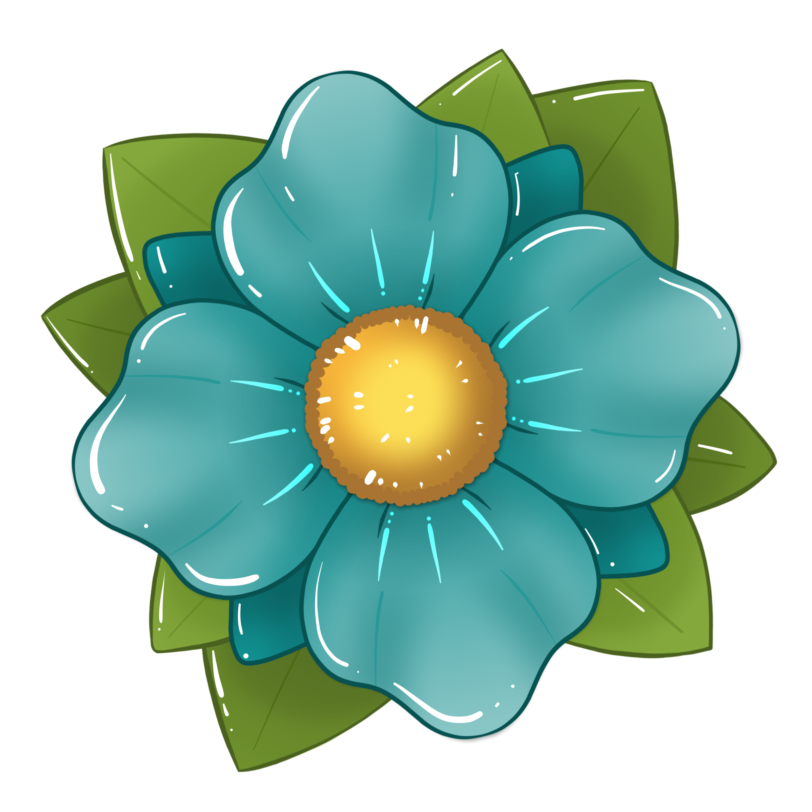

#  
# Blossom  
Minecraft Indev multiplayer client to connect to Spore servers  

**Author:** dannytaylor  
**Licence:** LGPL-3.0-or-later  

## Credits and Attributions
### Quilt Config  
**Author:** QuiltMC  
**Licence:** Apache-2.0  
**Source:** [https://github.com/QuiltMC/quilt-config](https://github.com/QuiltMC/quilt-config)  

### Kaleido Config  
**Authors:** sisby-folk  
**Licence:** LGPL-3.0  
**Source:** [https://github.com/sisby-folk/kaleido-config](https://github.com/sisby-folk/kaleido-config)

###  
SporeBlossom logo created by [@inetaarts.bsky.social](https://bsky.app/profile/inetaarts.bsky.social)  
Not affiliated with/endorsed by Mojang Studios or Microsoft.  
